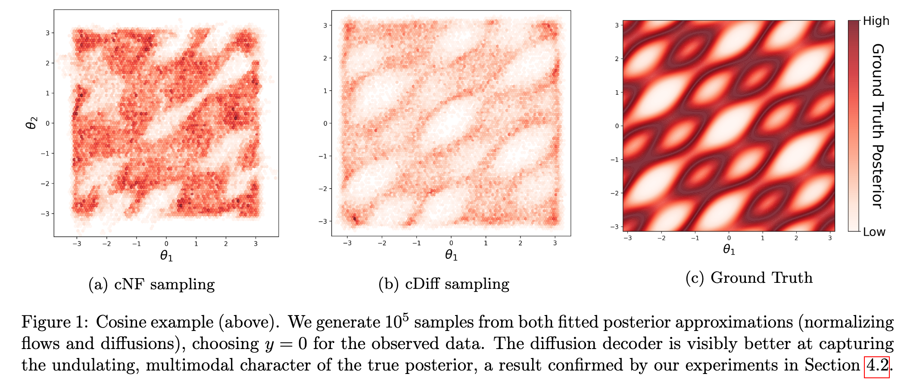
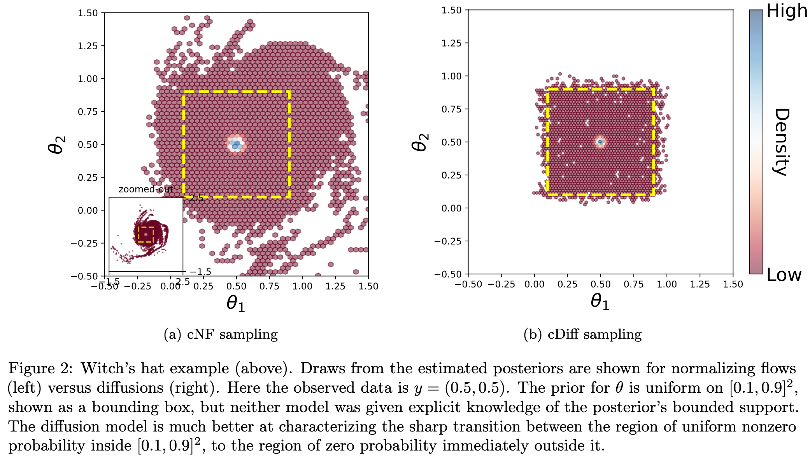
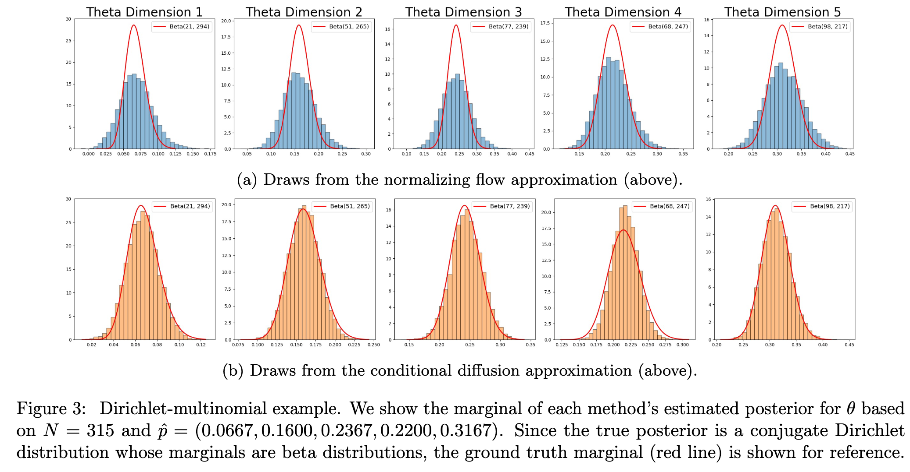

##  Conditional diffusions for neural posterior estimation

**[AISTATS 2025] Conditional diffusions for neural posterior estimation**<br>
[Tianyu Chen](https://tianyucodings.github.io/), [Vansh Bansal](https://bansal-vansh.github.io/), and [James G. Scott](https://jgscott.github.io/) <br> https://arxiv.org/abs/2410.19105
<br>

Abstract: *Neural posterior estimation (NPE), a simulation-based computational approach for Bayesian inference, has shown great success in situations where posteriors are intractable or likelihood functions are treated as "black boxes."  Existing NPE methods typically rely on normalizing flows, which transform a base distributions into a complex posterior by composing many simple, invertible transformations. But flow-based models, while state of the art for NPE, are known to suffer from several limitations, including training instability and sharp trade-offs between representational power and computational cost. In this work, we demonstrate the effectiveness of conditional diffusions as an alternative to normalizing flows for NPE. Conditional diffusions address many of the challenges faced by flow-based methods.  Our results show that, across a highly varied suite of benchmarking problems for NPE architectures, diffusions offer improved stability, superior accuracy, and faster training times, even with simpler, shallower models. Building on prior work on diffusions for NPE, we show that these gains persist across a variety of different encoder or "summary network" architectures, as well as in situations where no summary network is required.*

## cDiff: Summary-Decoder Framework for Amortized Sampling

We introduce a **summary-decoder framework** for amortized sampling, enabling efficient posterior inference without retraining. Given known prior $p(\theta)$ and forward model $p(X | \theta)$, our approach trains a **sampler** $q_\phi(\theta | s_\psi(X))$ that generalizes across datasets of varying sizes—eliminating the need for retraining on new data.

Our method features a **summary network** capable of handling both **exchangeable (IID) data** and **sequential (time-series) data**, making it highly versatile. Additionally, we integrate **[SBC](https://arxiv.org/abs/1804.06788)** and **[TARP](https://arxiv.org/abs/2302.03026) evaluation methods**, allowing users to assess the accuracy of the approximate posterior directly within the training process.

This framework provides a scalable and adaptable solution for amortized Bayesian inference, making it ideal for large-scale and dynamic settings. 🚀

We present three concise examples to demonstrate the effectiveness of our diffusion-based SBI method (**cDiff**) compared to the normalizing flow-based SBI method (**cNF**).







## Experiments

### Requirements
Installations of [PyTorch](https://pytorch.org/) is needed. Please see the ``requirements.txt`` for environment set up details.

### Running
Running experiments based our code could be quite easy, so below we use `normal_wishart` dataset as an example. 

```.bash
python main.py --save_path result --dataset normal_wishart --device 2 --data_type=iid --epochs=5000 --model=Diffusion --use_encoder  --save_model --eval_interval=40 --lr_decay  --n_run=10  --ecp_n_sim=100 --ecp_n_samples=200
```

### Custon Dataset

If you are interested in try our method for your own custom dataset (forward model), please go to `./datasets` folder and add a python file with your dataset name, for example, `./datasets/your_dataset_name.py`. You can mimic the structure of `./datasets/dirichlet_laplace.py`, but make sure you include these four functions: 

- sample_theta: sample from $p(\theta)$
- sample_X: sample from $p(X|\theta)$
- my_gen_sample_size: randomly decide how many $X$ you will sample from $p(X|\theta)$ for a $\theta$.
- return_dl_ds: register forward model to a dataloader.

With these component ready, go to `DATASET_CONFIG` in `./datasets/__init__.py`, register your dataset with new key value pair like

```.python
"your_dataset_name": {
        "module": "datasets.your_dataset_name",
        "dataset_generator": "return_dl_ds",
        "sample_theta": "sample_theta",
        "sample_data": "sample_X",
    },
```

Then you are able to run with your own dataset with 

```.bash
python main.py --save_path result --dataset your_dataset_name --device 2 --data_type=iid --epochs=5000 --model=Diffusion --use_encoder  --save_model --eval_interval=40 --lr_decay  --n_run=10  --ecp_n_sim=100 --ecp_n_samples=200
```

## Citation

If you find this open source release useful, please cite in your paper:
```
@article{chen2024conditional,
  title={Conditional diffusions for neural posterior estimation},
  author={Chen, Tianyu and Bansal, Vansh and Scott, James G},
  journal={arXiv preprint arXiv:2410.19105},
  year={2024}
}
```
